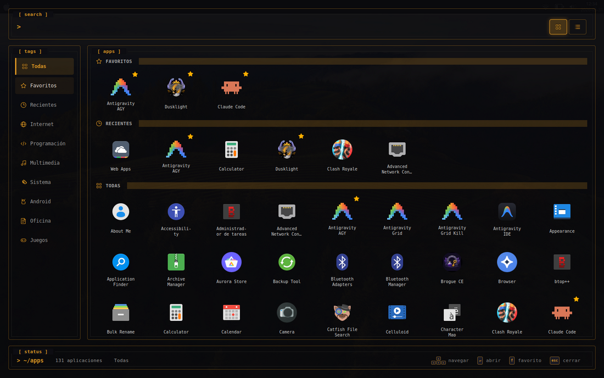
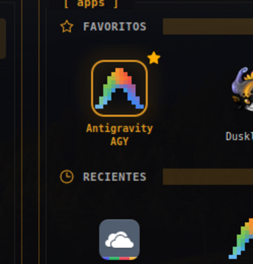
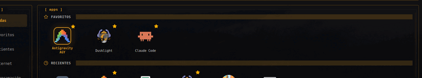

# vanilux

Un lanzador de aplicaciones a pantalla completa para Linux (estilo *Launchpad* de
macOS, con estética de terminal oscuro/ámbar), escrito en **C++17 + gtkmm 3**.
Se invoca con **F4** y queda **residente** en memoria para que las aperturas
siguientes sean instantáneas (como `rofi`).



---

## Tabla de contenidos

- [Características](#características)
- [Capturas](#capturas)
- [Dependencias](#dependencias)
- [Compilación e instalación](#compilación-e-instalación)
- [Configurar el atajo F4](#configurar-el-atajo-f4)
- [Uso (mouse y teclado)](#uso-mouse-y-teclado)
- [Cómo funciona el proceso residente](#cómo-funciona-el-proceso-residente)
- [Personalización](#personalización)
- [Estructura del proyecto](#estructura-del-proyecto)
- [Decisiones técnicas](#decisiones-técnicas)
- [Desarrollo y pruebas](#desarrollo-y-pruebas)
- [Resolución de problemas](#resolución-de-problemas)

---

## Características

- **Pantalla completa translúcida** con marco/paneles estilo TUI (`[ search ]`,
  `[ tags ]`, `[ apps ]`, `[ status ]`).
- **Descubrimiento automático de apps** parseando los `.desktop` de
  `/usr/share/applications`, `/usr/local/share/applications` y
  `~/.local/share/applications` (respeta `NoDisplay`, `Hidden`, `TryExec`).
- **Filtro por categorías (tags)** en la barra lateral: Todas, Favoritos,
  Recientes, Internet, Programación, Multimedia, Sistema, Android, Oficina,
  Juegos — cada una con su ícono SVG.
- **Búsqueda incremental** por nombre (case-insensitive, con *case folding*
  Unicode).
- **Favoritos y Recientes** persistentes en disco.
- **Glow ámbar** alrededor del ícono seleccionado, dibujado a mano con Cairo
  (borde nítido + halo difuso uniforme por *blur* real).
- **Navegación completa por teclado** (flechas, Enter, `f`, Esc) además de mouse,
  con **una sola selección a la vez** (*focus-follows-mouse*).
- **Arranque rápido**: la ventana aparece al instante y la grilla se puebla a
  continuación; los íconos de tema se rasterizan de forma perezosa (solo los
  visibles). El proceso queda **residente** para que las siguientes aperturas
  sean inmediatas.

## Capturas

| Selección (hover/teclado) | Navegación por teclado |
|---|---|
|  |  |

## Dependencias

Probado en **Linux Mint 22.3** (base Ubuntu 24.04), X11.

**Tiempo de compilación / ejecución:**

| Componente | Versión usada | Paquete Debian/Ubuntu |
|---|---|---|
| g++ (C++17) | 13.3.0 | `build-essential` |
| gtkmm | 3.24.9 | `libgtkmm-3.0-dev` |
| GTK+ | 3.24.41 | (dependencia de gtkmm) |
| pkg-config | — | `pkg-config` |
| GNU Make | — | `make` |

`libgtkmm-3.0-dev` arrastra el resto de forma transitiva: `giomm-2.4`,
`gtk+-3.0`, `cairomm-1.0`, `pangomm-1.4`, `gdk-pixbuf-2.0`, `atkmm-1.6`,
`gdkmm-3.0`, `glib-2.0` (de aquí sale `glib-unix.h`, usado para las señales).

**Recomendado en ejecución:**

| Componente | Para qué |
|---|---|
| `papirus-icon-theme` | tema de íconos que la app fuerza (`Papirus`) |

**Opcional (solo para regenerar las capturas/GIF de este README):**
`imagemagick` (`convert`), `xdotool`, `wmctrl`.

Instalación de dependencias:

```bash
sudo apt update
sudo apt install build-essential make pkg-config libgtkmm-3.0-dev papirus-icon-theme
```

## Compilación e instalación

```bash
# 1. Compilar
make                      # genera ./vanilux

# 2. Instalar binario + CSS + íconos (requiere root para /usr/local)
sudo make install         # ver "objetivo install" más abajo
```

`make install` copia:

- el binario a `/usr/local/bin/vanilux`
- el CSS a `/usr/local/share/vanilux/style.css`
- los íconos a `/usr/local/share/vanilux/icons/`

y hace `killall vanilux` para que cualquier instancia **residente vieja
muera** y la próxima F4 levante el binario nuevo.

> **Importante:** como el proceso es residente, **siempre** hay que matar la
> instancia anterior tras reinstalar; si no, seguirá ejecutándose el código
> viejo en memoria. `make install` ya lo hace.

Instalación manual equivalente:

```bash
make
sudo cp vanilux /usr/local/bin/
sudo mkdir -p /usr/local/share/vanilux/icons
sudo cp src/style.css /usr/local/share/vanilux/style.css
sudo cp src/icons/*.svg /usr/local/share/vanilux/icons/
killall vanilux 2>/dev/null || true
```

## Configurar el atajo F4

El binario no registra el atajo por sí mismo; se asigna en el entorno de
escritorio. En **Cinnamon** (Linux Mint):

*Configuración del sistema → Teclado → Atajos → Atajos personalizados* →
agregar un comando: `/usr/local/bin/vanilux`, y asignarle la tecla
**F4**.

Cada vez que se pulsa F4 se ejecuta el binario; éste detecta si ya hay una
instancia viva y, en ese caso, le envía una señal para **mostrar/ocultar** en
lugar de abrir otra (ver [proceso residente](#cómo-funciona-el-proceso-residente)).

## Uso (mouse y teclado)

| Acción | Mouse | Teclado |
|---|---|---|
| Mover la selección | pasar el cursor (hover) | ← ↑ → ↓ |
| Abrir app | clic | Enter |
| Marcar/desmarcar favorito | clic en la estrella ★ | `f` |
| Filtrar por categoría | clic en una tag | (entrar a la grilla con ↓) |
| Buscar | escribir en `[ search ]` | escribir (foco inicial ahí) |
| Cerrar/ocultar | clic en el fondo vacío | Esc |
| Mostrar/ocultar | — | **F4** (atajo del sistema) |

- Solo **un** ícono está resaltado a la vez: el hover del mouse y el foco del
  teclado comparten la misma selección (*focus-follows-mouse*).
- En cualquier tag distinta de **Todas** (incluidas *Favoritos* y *Recientes*)
  no se muestran las secciones de Favoritos/Recientes: solo la lista filtrada.

## Cómo funciona el proceso residente

```
F4 ─► /usr/local/bin/vanilux
        │
        ├─ ¿hay PID vivo en /tmp/vanilux.pid?
        │        │
        │        ├─ Sí ─► kill -SIGUSR1 <pid>  (la instancia viva alterna show/hide)
        │        │        └─ el proceso nuevo termina (exit 0)
        │        │
        │        └─ No ─► se vuelve la instancia residente:
        │                 escribe su PID, app->hold(), muestra la ventana
        │                 y se queda viva aunque la oculten.
```

- **Esc**, **clic en el fondo** o **abrir una app** → la ventana se **oculta**
  (no se cierra el proceso). Al ocultarse, resetea la vista (limpia búsqueda,
  vuelve a *Todas*, scroll arriba) *fuera de la ruta crítica*, así la próxima
  apertura es un simple `show()` instantáneo.
- **SIGTERM** cierra el proceso limpiamente (borra el PID file).
- La primera apertura tras el login paga **una sola vez** el costo de cargar el
  índice del tema Papirus (~300 ms); las siguientes son inmediatas.

## Personalización

- **Estilos:** se cargan desde `/usr/local/share/vanilux/style.css`
  (fallback: `src/style.css`, y un CSS embebido como último recurso). Editá ese
  archivo para cambiar colores, tipografías, tamaños, etc. El *glow* del ícono
  **no** está en el CSS (se dibuja en Cairo — ver decisiones técnicas).
- **Favoritos / Recientes:** se guardan en texto plano (un nombre por línea) en:
  - `~/.config/vanilux/favorites.txt`
  - `~/.config/vanilux/recents.txt` (máx. 6, los más recientes primero)
- **Tema de íconos:** la app fuerza `Papirus`. Se puede cambiar en el
  constructor de `LauncherWindow` (`property_gtk_icon_theme_name`).

## Estructura del proyecto

```
vanilux/
├── Makefile                 # build, test, install, clean
├── README.md
├── docs/
│   ├── ARCHITECTURE.md       # decisiones técnicas en profundidad
│   └── images/               # capturas y GIF del README
├── src/
│   ├── main.cpp              # entrypoint + lógica de residente/señales
│   ├── launcher_window.hpp   # AppIconButton + LauncherWindow
│   ├── launcher_window.cpp   # toda la UI, glow Cairo, navegación, filtros
│   ├── app_discovery.hpp     # AppEntry + AppDiscovery
│   ├── app_discovery.cpp     # parseo de .desktop y escaneo de dirs
│   ├── style.css             # estilos de la UI (paneles, tags, status…)
│   └── icons/                # SVGs propios (tags, estrellas, vistas)
└── tests/
    └── test_discovery.cpp    # tests del parser de .desktop
```

## Decisiones técnicas

Resumen (detalle completo en **[docs/ARCHITECTURE.md](docs/ARCHITECTURE.md)**):

- **El glow se dibuja con Cairo, no con `box-shadow` CSS.** En GTK 3 una
  `box-shadow` alternada por clase de estado se renderiza la primera vez pero no
  re-invalida su región en hovers posteriores. `AppIconButton::on_draw` dibuja
  el borde y el halo a mano y fuerza `queue_draw()`.
- **Halo uniforme por *blur* real.** En vez de apilar trazos (que se notan como
  capas), se estampa el borde en una superficie ARGB y se le aplica un *box
  blur* separable de varias pasadas → degradé liso.
- **El marco se ancla al ícono (`m_image`), tamaño fijo.** El contenedor del
  ícono se estira en la grilla; anclando al ícono el marco siempre lo abraza.
- **Selección única (*focus-follows-mouse*).** El glow se activa con
  `has_focus()`; al entrar el mouse se hace `grab_focus()`. Así mouse y teclado
  comparten una sola fuente de verdad y nunca brillan dos íconos.
- **Arranque:** escaneo de `.desktop` (~7 ms) es barato; el costo real es la
  carga única del índice de íconos de Papirus (~300 ms). Se mitiga con: poblado
  inicial diferido (la ventana pinta primero), rasterizado perezoso de íconos de
  tema (`set_from_icon_name`, solo dibuja los visibles), cache de estrellas e
  íconos de archivo, y sobre todo el **proceso residente**.

## Desarrollo y pruebas

```bash
make test     # compila y corre tests/test_discovery.cpp (parser de .desktop)
make clean    # borra binarios y objetos
```

Para probar cambios sin tocar el sistema, se puede ejecutar el binario local
directamente (recordá que es residente: matá la instancia previa primero):

```bash
make
killall vanilux 2>/dev/null
DISPLAY=:0 ./vanilux
```

## Resolución de problemas

- **"Cambié el código, recompilé, pero F4 sigue mostrando lo viejo".** Hay una
  instancia residente vieja en memoria. Ejecutá `killall vanilux` (o
  `make install`, que ya lo hace) y volvé a abrir con F4.
- **Íconos faltantes / genéricos.** Instalá `papirus-icon-theme`, o cambiá el
  tema forzado en `LauncherWindow`.
- **No aparece nada al pulsar F4.** Verificá que el atajo apunte a
  `/usr/local/bin/vanilux` y que el binario esté instalado. Revisá el PID
  file `/tmp/vanilux.pid` (si quedó *stale* con un PID muerto, la próxima
  ejecución lo detecta y arranca normal).
- **Los estilos no cambian.** Asegurate de copiar `src/style.css` a
  `/usr/local/share/vanilux/style.css` (o usar `make install`).
