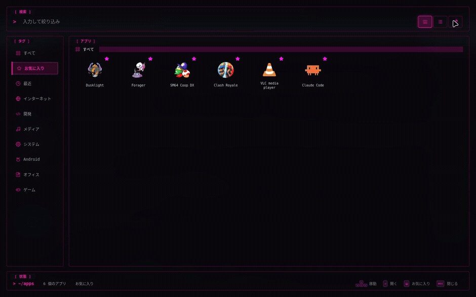
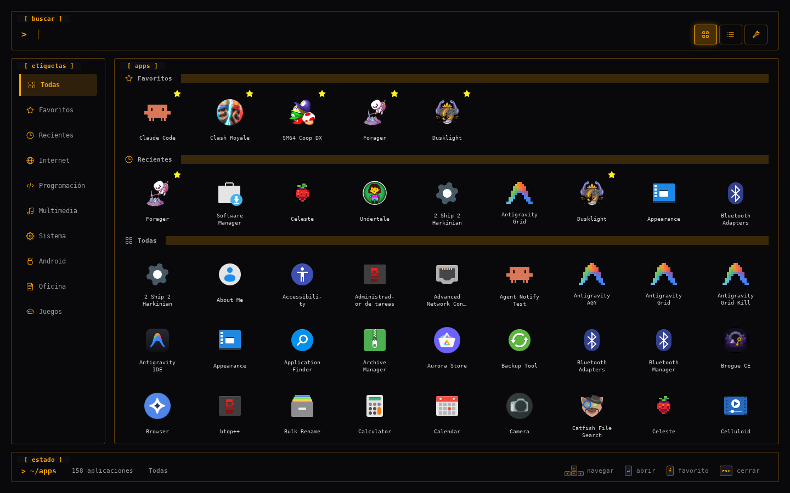
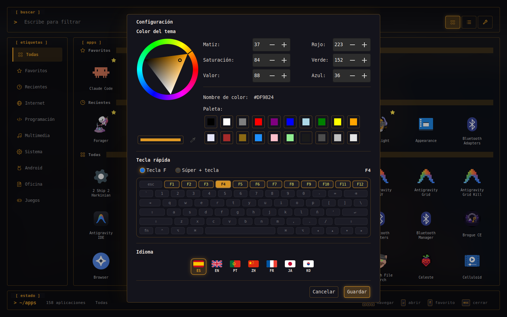
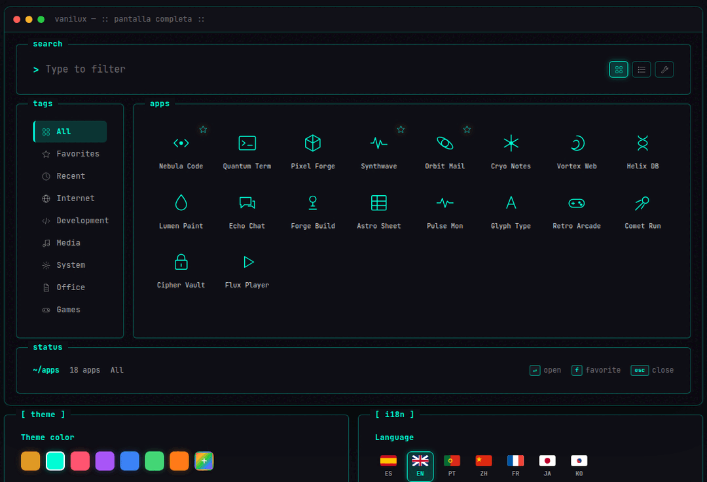

<div align="center">


# Vanilux

### Полноэкранный лаунчер приложений для Linux — с душой терминала.

[](https://facilized-pbustamante.github.io/vanilux/)

[Español](../../README.md) ·
[English](README.en.md) ·
[Português](README.pt.md) ·
[中文](README.zh.md) ·
[Français](README.fr.md) ·
[日本語](README.ja.md) ·
[한국어](README.ko.md) ·
[हिन्दी](README.hi.md) ·
**Русский**




</div>

---

**Vanilux** — это лаунчер приложений для Linux в стиле *Launchpad* с тёмной/янтарной
терминальной эстетикой. Вызывается по **F4**; остаётся **резидентным** в памяти — поэтому
следующее открытие мгновенно, как `rofi` — и **настраивается до пикселя**: меняйте цвет темы,
горячую клавишу и язык… вживую. Написан на **C++17 + gtkmm 3**: нативный, лёгкий и быстрый.
Без Electron, без тяжёлого рантайма.

## Возможности

| Возможность | Описание |
|---|---|
| Полный экран, эстетика TUI | Панели `[ search ]`, `[ tags ]`, `[ apps ]` и `[ status ]` с янтарными рамками. |
| Автоопределение | Разбирает системные и пользовательские `.desktop` (учитывает `NoDisplay`, `Hidden`, `TryExec`). |
| Инкрементальный поиск | Фильтр по имени, без учёта регистра, с Unicode case-folding. |
| Избранное и недавние | Сохраняются на диск между сеансами. |
| Янтарное свечение в Cairo | Ореол выбранного значка нарисован вручную с настоящим размытием. |
| Живой цвет темы | Палитра мгновенно перекрашивает весь интерфейс. |
| 9 языков | Экранная клавиатура адаптирует раскладку (QWERTY · AZERTY · кана · хангыль · чжуинь · кириллица). |
| Навигация с клавиатуры | Стрелки, Enter, `f`, Esc — а также мышь. |
| Резидентный процесс | Первый запуск загружает значки; следующие — мгновенно. |
| C++17 + gtkmm 3 | Нативный и лёгкий, без Electron. |

## Скриншоты

### Сетка


### Настройки — тема, горячая клавиша и язык


## Установка

**Пакет `.deb` (рекомендуется · Ubuntu / Linux Mint)** — скачайте `vanilux_1.1_amd64.deb` со страницы [Releases](https://github.com/facilized-pbustamante/vanilux/releases) и установите:

```bash
sudo apt install ./vanilux_1.1_amd64.deb
```

**Или соберите из исходников:**

```bash
git clone https://github.com/facilized-pbustamante/vanilux
cd vanilux
./install.sh
```

Установщик разрешает зависимости, собирает, копирует бинарник + CSS + значки,
создаёт пункт меню приложений и настраивает горячую клавишу `F4` (определяет Cinnamon, GNOME или XFCE).

| | |
|---|---|
| Ручная сборка | `make && sudo make install` |
| Зависимости | `build-essential` · `libgtkmm-3.0-dev` · `pkg-config` · `make` |
| Проверено на | Ubuntu 24.04 · Linux Mint 22.3 (X11) — g++ 13.3, gtkmm 3.24, GTK 3.24 |

## Использование

| Действие | Клавиша / жест |
|---|---|
| Открыть / закрыть лаунчер | <kbd>F4</kbd> |
| Фильтровать приложения | просто начните печатать |
| Навигация по сетке | <kbd>←</kbd> <kbd>↑</kbd> <kbd>↓</kbd> <kbd>→</kbd> |
| Открыть выбранное | <kbd>Enter</kbd> |
| Переключить избранное | <kbd>f</kbd> |
| Закрыть | <kbd>Esc</kbd> |
| Всё перечисленное | также мышью (наведение = свечение) |

## Настройка (вживую)

Откройте настройки кнопкой-гаечным ключом (вверху справа):



| Параметр | Что делает |
|---|---|
| Цвет темы | Круг + предустановки + hex; **всё** мгновенно перекрашивается. |
| Горячая клавиша | Выберите <kbd>F1</kbd>–<kbd>F12</kbd> или **Super + клавиша** на экранной клавиатуре. |
| Язык | Español · English · Português · 中文 · Français · 日本語 · 한국어 · हिन्दी · Русский — весь UI мгновенно. |

## Технологии

| Компонент | Детали |
|---|---|
| Язык | C++17 |
| Тулкит | gtkmm 3 (GTK 3) |
| Графика | Cairo (свечение вручную) |
| Дисплей | X11 |
| Проверено на | Ubuntu · Linux Mint |

## Веб-демо

На [`/landing`](../../landing/) есть презентационная страница с **интерактивным симулятором**
лаунчера (вымышленные приложения), где можно вживую попробовать смену цвета и языка:
**[facilized-pbustamante.github.io/vanilux](https://facilized-pbustamante.github.io/vanilux/)**

## Вклад

Issues и pull requests приветствуются.

---

<div align="center">

## ⭐ Понравился Vanilux?

### Поставьте звезду — это бесплатно и помогает проекту расти

[](https://github.com/facilized-pbustamante/vanilux)
&nbsp;
[](https://github.com/facilized-pbustamante/vanilux/stargazers)

[](https://star-history.com/#facilized-pbustamante/vanilux&Date)

<sub>vani<b>lux</b> · сделано на C++ и кофе ☕ · янтарная терминальная эстетика</sub>

</div>
